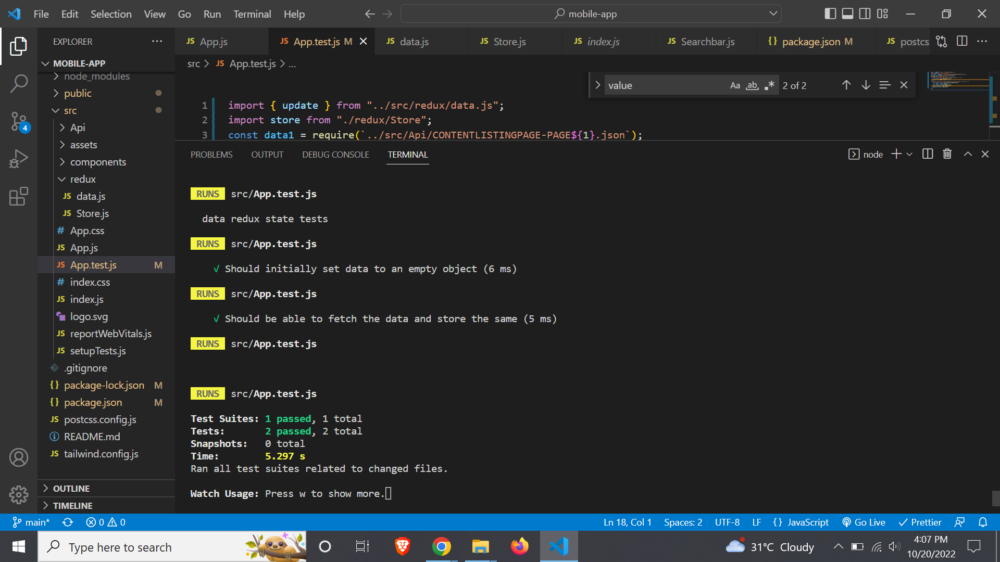

Developed mobile browser version of listing page using ReactJS with Redux and used TailwindCSS.

Used Lazy Loading of contents to load the contents gradually as the user scrolls down without showing the page loader.

Client Side search is implemented without refreshing/ reloading the page.

Implemented the page scroll with vertical scroll alone, implemented the same in search (fixed/ handled the default zoom in and horizontal scroll in search results - especially on iPhone mobile browsers)

Handled and satisfied the two content items on page 3.

Handled the image file extension mismatch with JSON to Asset. The asset were provided with .PNG but the JSON has a .JPG extension which throws an Module not found Error.

I tried following the instructions specified below “Redline” to follow the space specifications but I haven’t implemented the vertical space spec between the content as it completely collapses the entire design. Also the Nav Bar spec is not implemented, I have provided my own spec which brings the near match.

I am trying to write Unit Test using JEST and redux mock store. As I have committed to complete the task by today EOD. I will try adding the Unit test by tomorrow.

